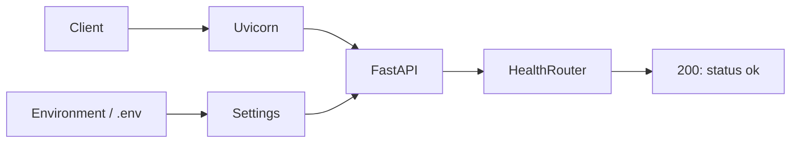

# AI Incident & Log Analysis Copilot (Day 1)

Day 1 implements the FastAPI foundation. The planned application helps investigate
synthetic application logs: **Python detects and calculates facts; the LLM explains
those facts and suggests investigation steps.** Uploads, PostgreSQL, analysis, and
Docker are scheduled for later days and are not implemented yet.

What was added:

- `app/main.py`: FastAPI application assembly.
- `app/routers/health.py`: typed `/health` endpoint.
- `app/config.py`: `pydantic-settings` configuration for environment variables.
- `requirements.txt`, `.env.example`, and `.gitignore`.

Quick start (from project root):

1. Create and activate a virtual environment (example using venv):

```powershell
py -3.12 -m venv .venv
.venv\Scripts\Activate.ps1
```

2. Install dependencies:

```bash
python -m pip install -r requirements.txt
cp .env.example .env
```

3. Run the app with Uvicorn:

```bash
python -m uvicorn app.main:app --reload --host 127.0.0.1 --port 8000
```

4. Verify health:

```bash
curl -sS http://127.0.0.1:8000/health
# expected: {"status":"ok"}
```

Swagger UI is available at `http://127.0.0.1:8000/docs`.

If PowerShell blocks activation, use `.venv\Scripts\python.exe` instead of
`python` in the run command. The existing workspace environment is ready to use.
For a fresh clone, install Python 3.12 first. A uv-created environment may not
include pip; use `python -m ensurepip` before installing dependencies in that case.

For WSL, create a separate Linux environment (do not reuse the Windows `.venv`):

```bash
python3.12 -m venv .venv-wsl
source .venv-wsl/bin/activate
python -m pip install -r requirements.txt
cp .env.example .env  # only if .env does not already exist
python -m uvicorn app.main:app --reload
```

Expected startup: Uvicorn reports `Application startup complete` and listens on
port 8000. Stop with Ctrl+C. Reload is for local development.

## Configuration

Settings read the project-root `.env` regardless of the working directory.
Environment variables override `.env`; restart after editing configuration.
Never commit `.env`. Blank external-service values let Day 1 run independently.

| Variable | Default | Purpose |
| --- | --- | --- |
| `DATABASE_URL` | blank | PostgreSQL connection, to be configured on Day 2 |
| `OPENAI_API_KEY` | blank | Secret API key, needed when LLM analysis is added |
| `OPENAI_MODEL` | blank | Explicit model selection when LLM analysis is added |
| `UPLOAD_DIRECTORY` | `uploads` | Future upload location, relative to working directory |
| `MAX_UPLOAD_SIZE_MB` | `5` | Positive integer for the future upload limit |

No database or model credentials are needed today. Secrets use `SecretStr` to
mask their representation; this is not encryption. Settings are never returned
by the health endpoint. A nonpositive or noninteger upload limit fails startup.

## Day 1 structure and concepts

```text
app/
  __init__.py
  main.py
  config.py
  routers/
    __init__.py
    health.py
  services/__init__.py
tests/.gitkeep
uploads/.gitkeep
.env.example
.gitignore
.python-version
requirements.txt
README.md
```

`FastAPI` is the application object. `APIRouter` groups related endpoints, much
like a Django app's `urls.py`. The `@router.get` decorator connects an HTTP method
and URL to a Python function, combining URL registration with the view definition.
`include_router` registers that group with the application.

Pydantic's `HealthResponse` describes and validates the response, similar to a
small DRF serializer. `BaseSettings` validates configuration from external values,
adding typed validation to the role served by Django settings. Uvicorn is the
ASGI server that accepts requests and runs the application. In `app.main:app`,
the left side is the Python module and the right side is its application object.



## Verification and manual test

In a second PowerShell terminal:

```powershell
curl.exe -i http://127.0.0.1:8000/health
curl.exe -I http://127.0.0.1:8000/docs
```

The health request must return HTTP 200 and `{"status":"ok"}`. Docs should
return HTTP 200. Open `/docs`, expand **GET /health**, click **Try it out**, then
**Execute**; expect the same JSON and status. Swagger UI is an interactive client
generated from the API's OpenAPI description at `/openapi.json`. Its browser assets
load from a CDN, so the interactive page needs internet access.

| Endpoint | Purpose |
| --- | --- |
| `GET /health` | Application liveness only |
| `GET /docs` | Swagger UI |
| `GET /openapi.json` | Machine-readable API schema |

Today uses live HTTP smoke checks. Parser/redactor Pytest coverage comes in later
days. Health does not verify database connectivity or LLM availability.

## Next days and boundaries

Day 2 adds PostgreSQL/SQLAlchemy, Day 3 uploads, Day 4 redaction/parsing,
Day 5 statistics/evidence, Day 6 LLM/background processing, and Day 7 completes
tests, Docker, and documentation. Use synthetic logs only. Week 1 excludes
authentication, multi-tenancy, a frontend, live streaming, and automatic remediation.
The planned analysis provides possible causes, never confirmed root causes.

Suggested commit: `feat: add Day 1 FastAPI foundation and health endpoint`

Interview questions:

1. What does Uvicorn do, and what does `app.main:app` mean?
2. How do FastAPI routers compare with Django URL patterns and views?
3. How does Pydantic Settings load, prioritize, and validate configuration?

References: [FastAPI first steps](https://fastapi.tiangolo.com/tutorial/first-steps/)
and [Pydantic settings](https://docs.pydantic.dev/latest/concepts/pydantic_settings/).
