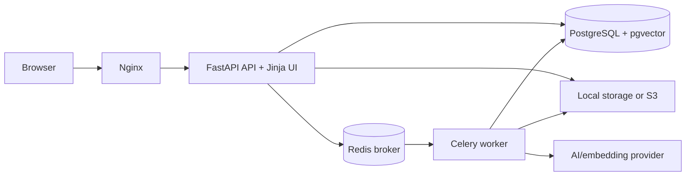

# Architecture

FastAPI owns validation, authentication, authorization, and HTTP presentation. The API
commits upload/job metadata before publishing identifier-only Celery messages. Workers
open their own database sessions, claim durable jobs, parse and redact logs, calculate
statistics, select evidence, call the provider only when needed, validate structured
output/citations, and commit visible progress. PostgreSQL is authoritative for users,
incidents, jobs, redacted events, analyses, runbook chunks, vectors, and audits. Object
storage retains source uploads; Redis is transport, not durable business state.

Runbook questions embed the question, use exact pgvector cosine search within authorized
runbooks, and either return cited chunks or insufficient context. Similar incident search
is owner-scoped and prefers human-confirmed resolutions. The UI calls the same public API.
